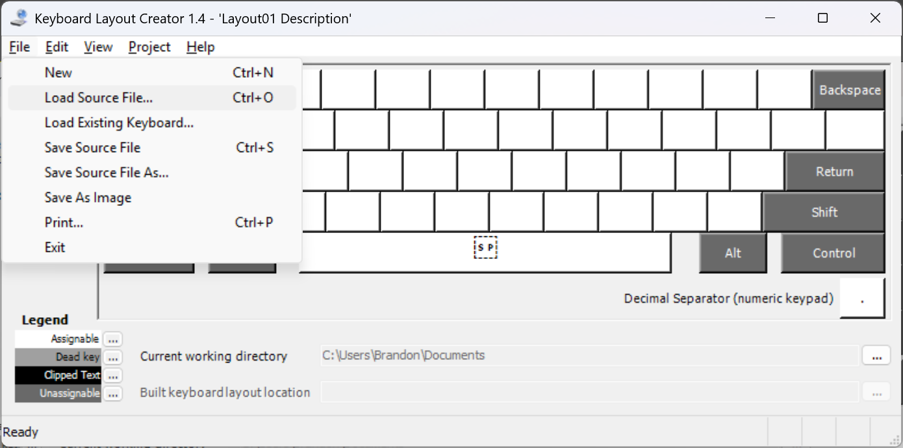
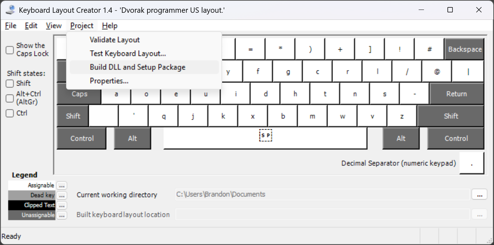
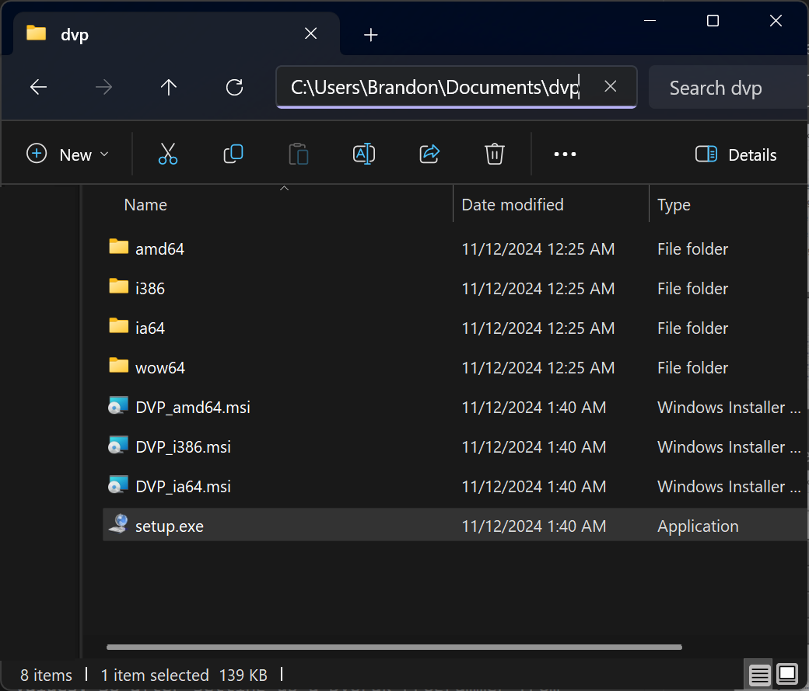

# Dvorak Programmer keyboard layout for Windows 11
There is no Dvorak Programmer keyboard layout distributed with Windows. This repository provides a recipe for reproducing the Dvorak Programmer layout using only official Microsoft tools. Various executable Windows installer programs for the Dvorak Programmer keyboard layout are available from unofficial sources. However, downloading executable programs to install a keyboard layout from unofficial sources can be dangerous and there is no guarantee such sources will be maintained. The official tool Microsoft Keyboard Layout Creator (MSKLC) has limitations which necessitate manual editing of the `.klc` layout definition file in order to support virtual key combinations like `ctrl+c` in all applications. The included `dvorak-programmer-MSKLC.klc` includes all the necessary manual edits to produce a fully functional Dvorak Programmer Layout in Windows 11 using MSKLC.

## Microsoft Keyboard Layout Creator (MSKLC)
Start by downloading the official [Microsoft Keyboard Layout Creator](https://www.microsoft.com/en-us/download/details.aspx?id=102134) which will be used to compile and install the keyboard layout in Windows.

**NOTE:** You must change the default install path to a directory path containing no spaces. The author uses `C:\MKLC\`

Under Windows 11 the default install path of `C:\Program Files\` will cause the following build errors:
```
cl.exe returned 1
rc.exe returned 1
link.exe returned 1
```
This is caused by the program converting directory paths to short file names in a way that does not preserve spaces in paths.

## Load the keyboard layout file
To run the MKLC type "Microsoft Keyboard Layout Creator" into the Windows search bar the application should be found on your system after installing the the last step.

After running the program seleft `Flie > Load Source File` and select the `dvorak-programmer-MSKLC.klc` file included with this repository. This is a text file so you are free to inspect the key definitions with your favorite text editor.


Next select `Project > Build DLL and Setup Package`


By default this should produce install files to `C:\Users\<you>\Documents\dvp\` but that is configurable, see images above.

## Install Dvorak Programmer Keyboard Layout

Navigate to the build directory and run `setup.exe` found there to install the Dvorak Programmer keyboard layout in Windows 11.


**NOTE:** You should also use this `setup.exe` to uninstall this layout cleanly.

## Reboot
As with pretty much anything in Windows, a reboot is needed to make sure registry updates are visible to the system.

## Multiple Layouts
To switch between multiple installed layouts in Windows you press the Windows + Space

## Poorly Implemented Layout Editor
This layout editor from Microsoft is barely functional for modern Windows 10 and 11 systems. The default install path results in a non-functioning program and you cannot remap the virtual key mappings at all in the GUI MSKLC. The MSKLC will not correctly implement virtual key `ctrl+<key>` mappings. If you were to create a Dvorak Programmer keyboard layout from a new project in the MSKLC, you would find all the usual `ctrl+<key>` for copy, paste, find, save, etc. would not work, or more accurately were still mapped to the QWERTY key locations. To work around this it is necessary to specify the virtual keys that correspond the the Dvorak Programmer layout on the proper scan code lines in the `VK_` column in the `.klc` file. Have a look at the included `.klc` to get an idea of how this works if you want to change these mappings or if you are creating your own layout.

## Happy Programming!

